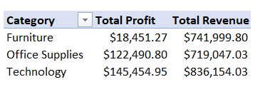
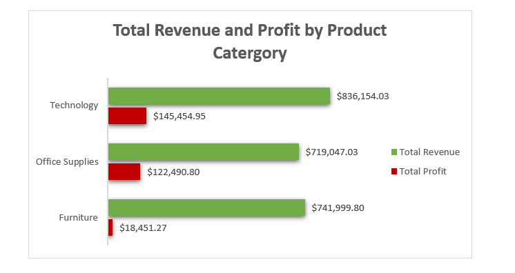
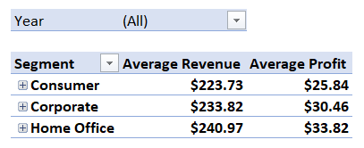
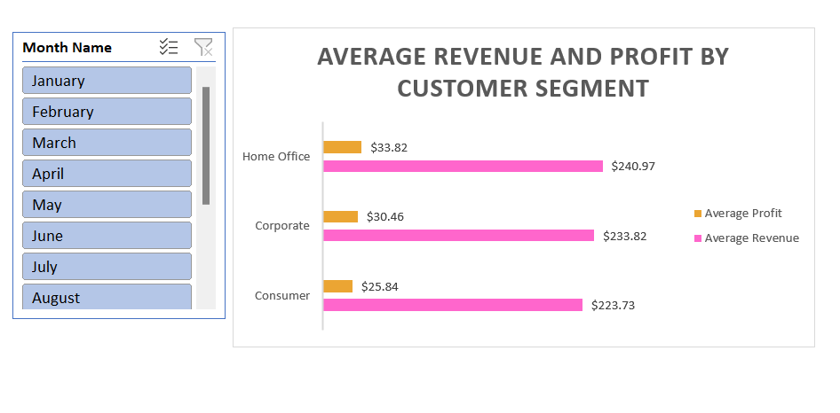
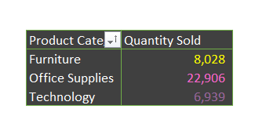
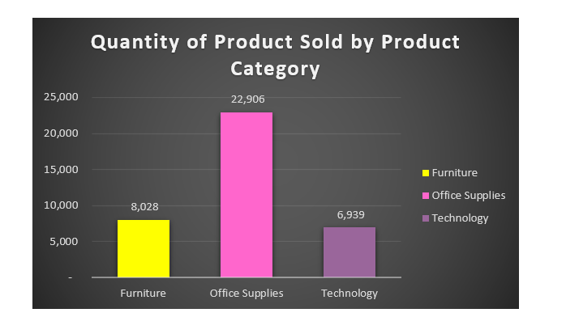

# BUSINESS-ANALYSIS-FOR-A-US-SUPERSTORE

## INTRODUCTION
This business report gives a comprehensive review of a renowned US Superstore's performance and trends from 2014 to 2017. The analysis, which draws on a range of data gathered over four years, provides significant insights into the superstore's operations, sales, profitability, customer segments, and regional dynamics. We will obtain a deeper understanding of the superstore's business landscape and have the ability to make data-driven decisions that can promote future success by meticulously evaluating the data.
I looked into multiple aspects of the superstore's operations throughout this analysis, throwing light on its strengths and areas for improvement. The analysis gives a vivid picture of the superstore's journey throughout the years, from measuring sales and profit trends to evaluating consumer segmentation and regional success.
This report aims to not only offer a retrospective picture of previous performance and a framework for future strategic planning for the superstore but also to demonstrate my skills in data analysis and interpretation utilising Excel formulae and functions. By understanding the patterns and insights obtained from this data, I am able to assist the US Superstore in making educated decisions to boost its competitiveness, improve customer happiness, and promote continuous development in the ever-changing retail market.
Let's go on a journey through the data to discover what story it tells about the performance and potential of the US Superstore.

*_Disclaimer_*: _All datasets used are dummy datasets and do not represent any company or institution._

## PROBLEM STATEMENT

1.	What is the distribution of total sales and profit across different product categories?
2.	How do sales and profit differ across the different customer segments?
3.	What is the total number of units sold across the different product categories? Which product had the least sales and how does it compare to the highest selling product?
4.	What are the numbers of customers shopping in each segment across the years?
5.	What is the customer retention rate over the years?
6.	How does profit vary by region?
7.	What is the trend in total profit over the four-year period (2014-2017)?

## SKILLS DEMONSTRATED
- Data Cleaning and Transformation: filling in the blanks and formatting the dataset to ensure the data does not return errors during analysis.
- Basic and Advanced Formulas and Functions: used to calculate and aggregate the dataset.
- Pivot Table: to analyse the dataset.
- Data Visualisation: using Pivot Charts to show comparisons, patterns and trends from the analysis done in the pivot table.
- Data Storytelling: using visuals to transform data into a compelling and engaging story 

## DATA SOURCING
This data was obtained from the US Superstore Dataset in the Data Analytics Cohort 4 Repository. The data contains 1 sheet with a table containing 9,994 rows and 13 columns.

## DATA TRANSFORMATION & CLEANING

The data provided was clean but it was transformed to accommodate some information required to elaborate the analysis carried out using the existing in the information in the dataset.

## ANALYSIS & VISUALISATION

### TOTAL REVENUE AND PROFIT BY PRODUCT CATEGORY

                         |
:-----------------------------------------------------------|---------------------------------------------------------------:
TOTAL PROFIT & REVENUE BY PRODUCT CATEGORY TABLE            |        TOTAL PROFIT & REVENUE BY PRODUCT CATEGORY VISUALISATION

"Technology" provides the highest overall income, demonstrating a significant demand for technology-related items among customers. This is also reflected in the company's high overall profit. The superstore may maintain its focus on this category in order to increase both sales and profitability. "Office Supplies" stands out due to its high overall profit, demonstrating that it is a very successful category.

#### RECOMMENDATION
- To continue reaping profits, the superstore should maintain a robust inventory and consider strategic pricing in this category by ensuring that popular and profitable categories such as "Technology" and "Office Supplies" are well-stocked to meet customer demand while avoiding overstocking in slower-moving categories such as "Furniture." 
- The superstore should think about broadening its product selection within each category and adding new and unique items as this diversity could allow for a broader range of client preferences while increasing sales. 
- Given that effective pricing tactics may increase profit margins, the superstore may look into price strategies, promotions, and promotional campaigns to maximise revenue and profitability across all categories.
- It is also important to keep an eye on market trends and client preferences in each area when making data-driven decisions as having an understanding of client wants and modifying product offerings to meet those needs can lead to long-term growth.

### AVERAGE REVENUE AND PROFIT BY SEGMENTS

                 |
:-----------------------------------------------------------|---------------------------------------------------------------:
AVERAGE PROFIT & REVENUE BY SEGMENT TABLE                   |        AVERAGE PROFIT & REVENUE BY SEGMENT VISUALISATION

According to the analysis of average revenue and profit across different customer categories, the  "Home Office" customer segment has the highest average revenue, followed by the "Corporate" sector and finally the "Consumer" segment. This indicates that consumers in the "Home Office" sector make bigger purchases on average than customers in the other categories. Similar to the average revenue, the "Home Office" segment has the largest average profit per transaction, as well as the highest average revenue. The "Corporate" category is second in terms of profit, while the "Consumer" segment has the lowest average profit per transaction. These can be attributed to a variety of factors ranging from Customer Purchase Behaviour, Product Preferences, Market Dynamics, Product recommendations, or the Pricing strategy adopted by the Superstore.

#### RECOMMENDATION

- To maximise profitability, the superstore should continue to analyse each segment's distinct features and modify marketing, product, and pricing strategies appropriately.
- In all segments, strategies for raising average transaction value, such as combining similar goods or providing personalised suggestions, can be helpful.
- Customer retention efforts can be concentrated in particular on the "Home Office" sector, which has the highest profitability.
- Consistent price and product offering monitoring and modification can assist to maintain and improve profitability across all segments.

### QUANTITY OF PRODUCT SOLD BY PRODUCT CATEGORY

                             |
:-----------------------------------------------------------|---------------------------------------------------------------:
AVERAGE PROFIT & REVENUE BY SEGMENT TABLE                   |        AVERAGE PROFIT & REVENUE BY SEGMENT VISUALISATION

"Technology" has the lowest sales (6,939 units sold), while "Office Supplies" has the highest number of sales (22,906 units sold). Based on this, "Office Supplies" has the highest sales, outselling "Furniture" and "Technology" by a wide margin, making it the best-selling product category, while "Technology" has the lowest sales, indicating that it is the least popular product category in terms of unit sales.

#### RECOMMENDATION

- The superstore can explore measures that will boost sales in the "Technology" area, or it may concentrate on optimising its supplies and marketing for the more popular "Office Supplies" category.

## CUSTOMER RETENTION RATE

