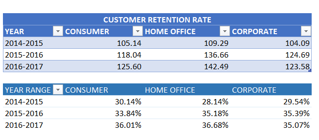

# BUSINESS-ANALYSIS-FOR-A-US-SUPERSTORE

## INTRODUCTION
This business report gives a comprehensive review of a renowned US Superstore's performance and trends from 2014 to 2017. The analysis, which draws on a range of data gathered over four years, provides significant insights into the superstore's operations, sales, profitability, customer segments, and regional dynamics. We will obtain a deeper understanding of the superstore's business landscape and have the ability to make data-driven decisions that can promote future success by meticulously evaluating the data.
I looked into multiple aspects of the superstore's operations throughout this analysis, throwing light on its strengths and areas for improvement. The analysis gives a vivid picture of the superstore's journey throughout the years, from measuring sales and profit trends to evaluating consumer segmentation and regional success.
This report aims to not only offer a retrospective picture of previous performance and a framework for future strategic planning for the superstore but also to demonstrate my skills in data analysis and interpretation utilising Excel formulae and functions. By understanding the patterns and insights obtained from this data, I am able to assist the US Superstore in making educated decisions to boost its competitiveness, improve customer happiness, and promote continuous development in the ever-changing retail market.
Let's go on a journey through the data to discover what story it tells about the performance and potential of the US Superstore.

*_Disclaimer_*: _All datasets used are dummy datasets and do not represent any company or institution._

## KEY PERFORMANCE INDICATORS (KPIs)

     
:-----------------------------------------------------------:
            

## BUSINESS QUESTIONS

1.	What is the distribution of total sales and profit across different product categories?
2.	How do sales and profit differ across the different customer segments?
3.	What is the total number of units sold across the different product categories? Which product had the least sales and how does it compare to the highest selling product?
4.	What are the numbers of customers shopping in each segment across the years?
5.	What is the customer retention rate over the years?
6.	How does profit vary by region?
7.	What is the trend in total profit over the four-year period (2014-2017)?

## SKILLS DEMONSTRATED
- Data Cleaning and Transformation: filling in the blanks and formatting the dataset to ensure the data does not return errors during analysis.
- Basic and Advanced Formulas and Functions: used to calculate and aggregate the dataset.
- Pivot Table: to analyse the dataset.
- Data Visualisation: using Pivot Charts to show comparisons, patterns and trends from the analysis done in the pivot table.
- Data Storytelling: using visuals to transform data into a compelling and engaging story 

## DATA SOURCING
This data was obtained from the US Superstore Dataset in the Data Analytics Cohort 4 Repository. The data contains 1 sheet with a table containing 9,994 rows and 13 columns.

## DATA TRANSFORMATION & CLEANING

The data provided was clean but it was transformed to accommodate some information required to elaborate the analysis carried out using the existing in the information in the dataset.

## ANALYSIS, VISUALISATION & BUSINESS INSIGHTS

### TOTAL REVENUE AND PROFIT BY PRODUCT CATEGORY

                         |
:-----------------------------------------------------------|---------------------------------------------------------------:
TOTAL PROFIT & REVENUE BY PRODUCT CATEGORY TABLE            |        TOTAL PROFIT & REVENUE BY PRODUCT CATEGORY VISUALISATION

"Technology" provides the highest overall income, demonstrating a significant demand for technology-related items among customers. This is also reflected in the company's high overall profit. The superstore may maintain its focus on this category in order to increase both sales and profitability. "Office Supplies" stands out due to its high overall profit, demonstrating that it is a very successful category.

#### RECOMMENDATION
- To continue reaping profits, the superstore should maintain a robust inventory and consider strategic pricing in this category by ensuring that popular and profitable categories such as "Technology" and "Office Supplies" are well-stocked to meet customer demand while avoiding overstocking in slower-moving categories such as "Furniture." 
- The superstore should think about broadening its product selection within each category and adding new and unique items as this diversity could allow for a broader range of client preferences while increasing sales. 
- Given that effective pricing tactics may increase profit margins, the superstore may look into price strategies, promotions, and promotional campaigns to maximise revenue and profitability across all categories.
- It is also important to keep an eye on market trends and client preferences in each area when making data-driven decisions as having an understanding of client wants and modifying product offerings to meet those needs can lead to long-term growth.

### AVERAGE REVENUE AND PROFIT BY SEGMENTS

                 |
:-----------------------------------------------------------|---------------------------------------------------------------:
AVERAGE PROFIT & REVENUE BY SEGMENT TABLE                   |        AVERAGE PROFIT & REVENUE BY SEGMENT VISUALISATION

According to the analysis of average revenue and profit across different customer categories, the  "Home Office" customer segment has the highest average revenue, followed by the "Corporate" sector and finally the "Consumer" segment. This indicates that consumers in the "Home Office" sector make bigger purchases on average than customers in the other categories. Similar to the average revenue, the "Home Office" segment has the largest average profit per transaction, as well as the highest average revenue. The "Corporate" category is second in terms of profit, while the "Consumer" segment has the lowest average profit per transaction. These can be attributed to a variety of factors ranging from Customer Purchase Behaviour, Product Preferences, Market Dynamics, Product recommendations, or the Pricing strategy adopted by the Superstore.

#### RECOMMENDATION

- To maximise profitability, the superstore should continue to analyse each segment's distinct features and modify marketing, product, and pricing strategies appropriately.
- In all segments, strategies for raising average transaction value, such as combining similar goods or providing personalised suggestions, can be helpful.
- Customer retention efforts can be concentrated in particular on the "Home Office" sector, which has the highest profitability.
- Consistent price and product offering monitoring and modification can assist to maintain and improve profitability across all segments.

### QUANTITY OF PRODUCT SOLD BY PRODUCT CATEGORY

                                      |
:--------------------------------------------------------------------|-----------------------------------------------------------------:
QUANTITY OF PRODUCT SOLD BY PRODUCT CATEGORY TABLE                   |        QUANTITY OF PRODUCT SOLD BY PRODUCT CATEGORY VISUALISATION

"Technology" has the lowest sales (6,939 units sold), while "Office Supplies" has the highest number of sales (22,906 units sold). Based on this, "Office Supplies" has the highest sales, outselling "Furniture" and "Technology" by a wide margin, making it the best-selling product category, while "Technology" has the lowest sales, indicating that it is the least popular product category in terms of unit sales.

#### RECOMMENDATION

- The superstore can explore measures that will boost sales in the "Technology" area, or it may concentrate on optimising its supplies and marketing for the more popular "Office Supplies" category.

## CUSTOMER RETENTION RATE

                             |
:-------------------------------------------------------------|---------------------------------------------------------------:
CUSTOMER RETENTION RATE TABLE                                 |       CUSTOMER RETENTION RATE VISUALISATION

The analysis identified the following: 
- In 2015, the store retained 30.14% of its consumer customers, 28.14% of its home office customers, and 29.54% of its corporate customers from the Year 2014.
- In 2016, the store retained 33.84% of its consumer customers, 35.18% of its home office clients, and 35.39% of its corporate customers from the Year 2015.
- In 2017, the store retained 36.01% of its consumer customers, 36.68% of its home office customers, and 35.07% of its corporate customers from the Year 2016.
These figures show the proportion of customers that made further purchases or stayed with the store from one year to the next. According to the data, the store's customer retention rates have increased over time, with the highest retention rates occurring in the most recent year period (2016-2017). This demonstrates that the higher the retention rate, the better the store's ability to keep its consumers over time as a higher customer retention rate is considered to be advantageous since it indicates customer loyalty and happiness.

#### RECOMMENDATION

- The store may continue to focus on enhancing customer loyalty to sustain this positive trend.

## PROFIT MARGIN BY REGION

                             |
:---------------------------------------------------------------|---------------------------------------------------------------:
PROFIT MARGIN BY REGION TABLE                                   |       PROFIT MARGIN BY REGION VISUALISATION

Regional factors such as economic conditions, customer behaviour, competition, and cost structures all contribute to the significant variations in profit margins across regions. The Central Region has a negative profit margin (-20.11%), indicating that the superstore is losing money in this area. This might be ascribed to issues such as economic difficulties, increased competition, and higher operational expenses in the Central area. The South Region has a positive profit margin (22.03%), indicating that the superstore is profitable in this area. This might be due to a variety of factors, including economic growth, cost efficiency, and alignment with local taste, which allows for premium pricing. The East Region has a high-profit margin (39.61%) due to the region's affluent demography, strong local economy, and efficient operations. The West Region boasts the highest profit margin (58.47%), which may be ascribed to factors such as a high cost of living, high demand for technology and innovation as it is the hub for technology and innovation in the US and strict cost-control methods. Regional profit margin variances are primarily impacted by a combination of economic, competitive, and operational factors that influence consumer spending, cost management, and pricing tactics. 

#### RECOMMENDATION
Understanding and reacting to these regional patterns is critical for the overall financial performance of the superstore.

## TOTAL PROFIT BY MONTH ACROSS THE FOUR-YEAR PERIOD

                                 |
:-------------------------------------------------------------|---------------------------------------------------------------:
TOTAL PROFIT BY MONTH TABLE                                   |       TOTAL PROFIT BY MONTH VISUALISATION

The numbers from 2014 to 2017 may demonstrate a regular pattern in which the Superstore makes more money during the holiday season (November and December) and somewhat less money in the early months of the year (January and February). Typically, the year begins with reduced earnings in January and February, followed by a big boost in profit in March, probably owing to the conclusion of the fiscal year and increased sales. Profit is largely stable in April but rises in May, probably as a result of spring and early summer sales. Profit decreased somewhat in June, but it remained consistent in July. Profit begins to increase again in August and continues to rise in September and October, probably owing to back-to-school purchasing and early holiday preparations. Profit peaks are often attained in November and December, which corresponds to the holiday buying season.

##### SEASONAL TREND
The analysis shows a clear seasonal pattern, with the highest earnings recorded in November and December, most likely as a result of Christmas shopping. There was also a rise in profit in the spring and early summer (March to May) which was probably due to customers refurbishing their houses and preparing for the summer season. The autumn season (September to October) also experienced an increase, which may be linked to back-to-school buying.

#### RECOMMENDATION
- By using the observed seasonal trends, the store can design promotions, marketing campaigns, and inventory management tactics to maximise revenue during peak months.
- It should ensure that it has enough inventory and manpower to handle the increased demand throughout the holiday season.
- During the slower months, strategies for reducing costs can be used to successfully control expenditures.

## TOTAL REVENUE AND REVENUE GROWTH RATE OVER THE YEARS

                                |
:-------------------------------------------------------------|---------------------------------------------------------------:
TOTAL REVENUE AND REVENUE GROWTH RATE TABLE                    |       TOTAL REVENUE AND REVENUE GROTH RATE VISUALISATION

The Superstore's overall income changed over the four-year period from 2014 to 2017. Revenue fell slightly between 2014 and 2015 with a -3% growth rate. In 2016, there was significant revenue growth of 29% growth rate, which was followed by another boom year in 2017 with a 20% growth rate. For these years, the average yearly sales increase was 16%. Despite a slight decline in 2015, the store managed to accomplish four years of positive sales growth, with a significant increase in 2016 and 2017 which could be linked to successful strategies, including effective marketing campaigns, product offerings, or customer engagement. In 2018, revenues are expected to total $848,074.05. This projection is based on historical growth rates and averages of the previous years.

#### RECOMMENDATION

To sustain and expand on this performance, the Store should consider: 
- identifying and repeating specific variables that led to growth in 2016 and 2017;
- investing in customer acquisition and retention initiatives;
- tracking market developments and consumer preferences in order to alter product offers as needed;
- maintaining profitability by focusing on operational efficiency and cost control.
